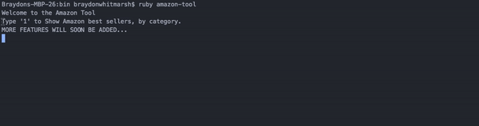

# Amazon Tool

This is a tool to allow users to find the top 3 bestsellers in each Amazon Category.
More features to be added soon including a review generator.

## Contributing

Bug reports and pull requests are welcome on GitHub at https://github.com/'braydon322'/amazon_tool. This project is intended to be a safe, welcoming space for collaboration, and contributors are expected to adhere to the [Contributor Covenant](http://contributor-covenant.org) code of conduct.

## License

This is available as open source under the terms of the [MIT License](http://opensource.org/licenses/MIT).

## Code of Conduct

Everyone interacting in the AmazonTool project’s codebases, issue trackers, chat rooms and mailing lists is expected to follow the [code of conduct](https://github.com/'braydon322'/amazon_tool/blob/master/CODE_OF_CONDUCT.md).
